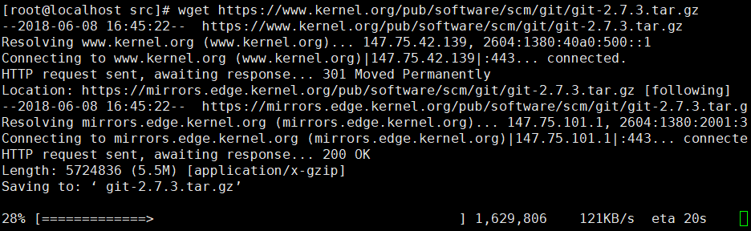

#CentOS搭建Git服务器
时间：2018年6月7日21:35:29

由于CentOS原本就有一个Git服务（看你安装时候的选择...），如果不嫌老的话，可以直接使用
>yum info git
>

默认是1.8.x，目前最新的应该2.x了，我嫌弃他老了，所以来更新服务

##安装操作
先安一波依赖库
>yum install curl-devel expat-devel gettext-devel openssl-devel zlib-devel
>yum install gcc perl-ExtUtils-MakeMaker

####卸载旧版的Git服务
>yum remove git

####安装Git服务
目前的Git服务版本是2.9.5（2018年6月7日），但为了保证服务稍微稳定一些,安装一个2.7.3
#####注意自己文件存放的位置！！！
>wget https://www.kernel.org/pub/software/scm/git/git-2.7.3.tar.gz
>
>>文件获取完毕
>>
>
>解压下载的文件
>tar -xzvf git-2.7.3.tar.gz

解压完之后，开始编译程序？
>cd git-2.7.3/
>make configure
>./configure --prefix=/usr/git
>make profix=/usr/git
>make install
>####如果报错了，一般是你没有安装依赖库，或者还缺少一下的软件包
>yum install perl-ExtUtils-CBuilder perl-ExtUtils-MakeMaker cpan -y

>出现什么异常已经去百度！

不出意外地话就应该安装好

####添加环境变量

>将我们安装的路径放进系统变量
>echo "export PATH=$PATH:/usr/git/bin" >> /etc/profile
>
>使系统变量立刻生效
>source /etc/profile

#安装已完成
这时候就可以输入git命令查看是否生效了

查看Git
>git --version

